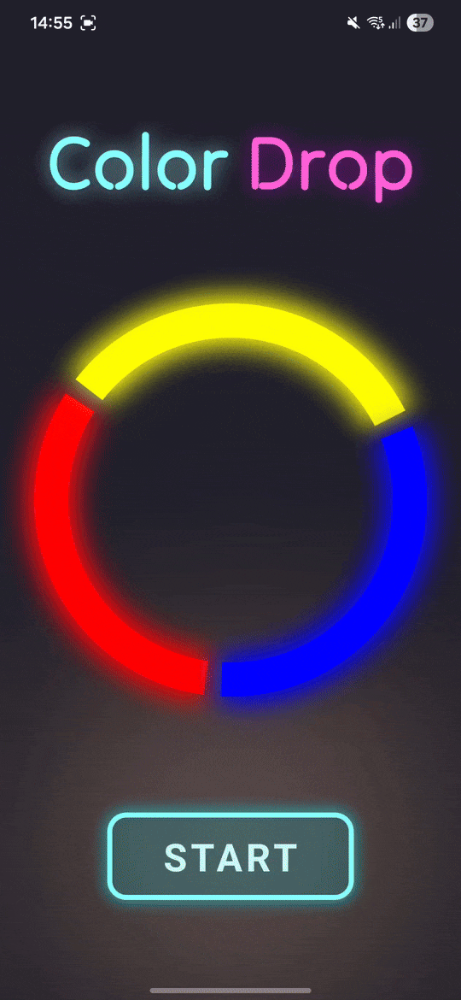

# 🔴 🟡 🔵 Color Drop 🔵 🟡 🔴

Minimalistyczna gra zręcznościowa stworzona w React Native z użyciem m.in. Reanimated i Skia, działająca w środowisku Expo.

## O grze

Color Drop to gra sprawdzająca twój refleks. Celem jest obracanie 3-kolorowego koła, aby dopasować jego segment do koloru spadającej kropli. Gra z czasem przyspiesza i wprowadza mechanikę "mieszania kolorów". Całość doprawiona jest dopracowanymi, płynnymi animacjami.



**Pełny gameplay:** [https://youtube.com/shorts/COmROuSNkOs](https://youtube.com/shorts/COmROuSNkOs)


## Uruchomienie

#### Instalacja

```
git clone https://github.com/AleksZ28/Color-Drop
```

```
cd Color-Drop
```

```
npm install
```

__Aplikacja testowana była na urządzeniu fizycznym z systemem Android.__
Nie była testowana na systemie iOS, więc nie mogę zagwarantować bezbłędnego działania na nim.

#### ⚠️ Uwagi dot. wydajności

Aplikacja intensywnie korzysta z animacji (Reanimated + Skia), przez co środowisko deweloperskie może obniżać płynność.

__Bardziej zalecane jest uruchamianie gry na fizycznym urządzeniu niż na emulatorze z powodu niskiej wydajności i opóźnienia emulatora. Gra jest dynamiczna, więc uruchomienie jej na emulatorze może obniżyć feeling. Ponadto gra zawiera haptyczne wibracje, które siłą rzeczy nie istnieją na emulatorze.__

Aby zobaczyć rzeczywistą wydajność gry, najlepiej uruchamiać projekt na jeden z trzech sposobów:

1. Zbuildowane apk (najlepszy rezultat)
```
eas build -p android --profile preview
```
Zbuildowane przeze mnie apk dostępne jest pod linkiem:
[https://expo.dev/accounts/aleksz/projects/color-drop/builds/4ff31114-e043-4bc1-9616-240f511cd8cb](https://expo.dev/accounts/aleksz/projects/color-drop/builds/4ff31114-e043-4bc1-9616-240f511cd8cb)

2. Expo Go (płynność zbliżona do natywnej)
```
npx expo start
```

3. Natywne uruchomienie 
```
npx expo run:android
```

Obowiązkowe jest wyłączenie JS Dev Mode oraz Fast Refresh w celu zwiększenia performance'u. Mimo wszystko ten sposób nie daje najlepszych rezultatów.

---

### Kluczowe mechaniki

- Dynamiczny poziom trudności: Gra automatycznie przyspiesza i zwiększa złożoność w miarę postępów gracza.

- Mieszanie kolorów: Po osiągnięciu progu punktowego 100pkt, gra zaczyna zrzucać kolory wtórne (Pomarańczowy, Zielony, Różówy). Gracz musi trafić między dwoma kolorami koła, aby je "stworzyć".

- Mnożnik: Trzy udane trafienia zwiększają mnożnik punktów.

- Interaktywny tutorial: Aplikacja wykrywa pierwsze uruchomienie i za pomocą pauzujących grę nakładek uczy gracza zasad gry.

- Wibracje przy trafieniu lub błędzie.

- Dźwięki zsynchronizowane z akcjami w grze.

- Najlepszy wynik: Najwyższy wynik zapisywany jest lokalnie na urządzeniu, dzięki czemu pozostaje nawet po zamknięciu aplikacji.


### Efekty wizualne:

- Płynne animacje przejścia pomiędzy menu a grą

- Animujące się napisy z neonowym efektem

- Efekt rozprysku kropli na cząsteczki

- Animacja kropli w trakcie spadania

- Efekt shake ekranu przy błędzie

- Generowane kolorowe tło z dynamicznymi rozmytymi kółkami unoszącymi się losowo

- Animacje zmiany puntkacji oraz mnożnika

### Zastosowane technologie to m.in.:

- React Native z Expo
- react-native-reanimated
- @shopify/react-native-skia
- react-native-gesture-handler
- react-native-async-storage
- expo-audio
- expo-haptics
- expo-linear-gradient

### Architektura:

1. `app/index.tsx`

   - Główny plik gry, który inicjalizuje wszystkie hooki i komponenty, łączy logikę gry, animacje, sterowanie oraz menu w jedną spójną całość.

   - Zawiera bazowy layout aplikacji.

   - Warunkowo renderuje elementy.

2. `hooks/`

   - `useGameLoop.ts`: główny silnik gry działający na wątku UI

   - `useWheelGesture.ts`: zarządza gestem obracania koła
   
   - `useMenuTransition.ts`: zarządza płynnym przejściem między menu a grą

   - `useShakeEffect.ts`, `useNeonFlicker.ts`, `useGameDimensions.ts`: hooki pomocnicze dla efektów i wymiarów

3. `components`

   - Komponenty Skia: `Wheel.tsx`, `Drop.tsx`, `Particle.tsx`, `AuroraBackground.tsx`, `Blob.tsx`

   - Komponenty UI: `ScoreCounter.tsx`, `Multiplier.tsx`, `NeonButton.tsx`, `TutorialOverlay.tsx`, `GameOver.tsx`

4. `assets/`
   - Zawiera zasoby gry takie jak ikona oraz dźwięki.

5. `utils/`
   - Funkcje pomocnicze: zapis i odczyt najlepszego wyniku z AsyncStorage (`highScore.ts`), odtwarzanie dźwięków (`audio.ts`), obsługa wibracji (`haptics.ts`)

6. `constants/gameConfig.ts`
   - Stałe używane w grze.

7. `types/`
   - Definicja globalnego typu GameState.